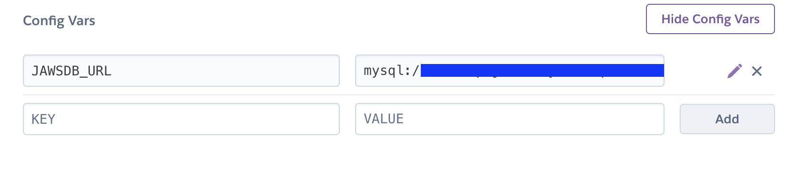
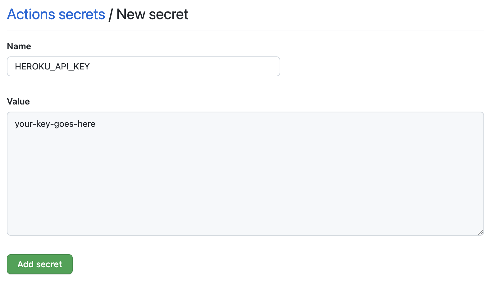
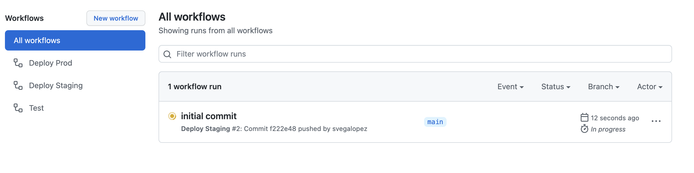
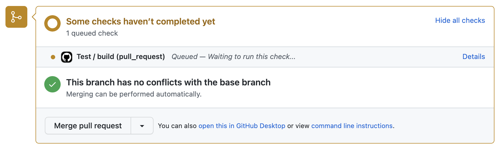
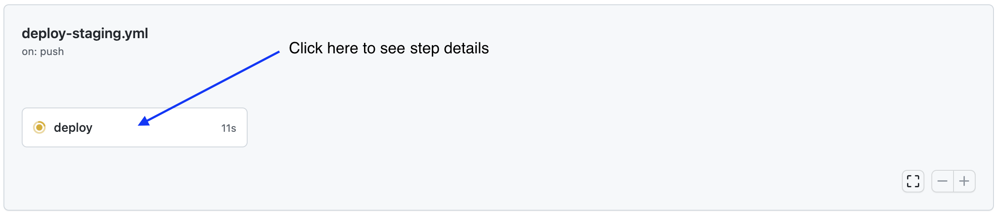

# Introduction

In this demo you will setup a simple CI-CD pipeline that runs automated tests every time a PR is opened against the main branch of your Github repository. The tests will run in parallel (each test file spins its own independent db, runs migrations and creates test data). When code is pushed to the main branch (such as when a PR is merged), the main branch will be deployed to a staging environment in Heroku. A "heroku-postbuild" script is in charge of running migrations in Heroku prior to deploying every time.

# Table of Contents

- [Setting up Heroku](#setting-up-heroku)
- [Setting up Github](#setting-up-github)
- [Push to Origin](#push-to-origin)
- [Developing your feature](#developing-your-feature)

---

## Setting up Heroku  

1. Create a project for your **staging** environment in Heroku:

   a) Register for a heroku account if you don't have one already.

   b) Visit [your heroku dasboard](https://dashboard.heroku.com/apps) and select: `New > Create new app`.

   c) Enter your app name. It is recommended to use something like "my-unique-name-staging".

   d) Visit the `Resources` tab in your app dashboard and under `Add-ons` search for `JawsDB MySQL`.

   e) Choose the FREE plan for JawsDB by clicking on `Submit Order Form`.  

2. In your [Heroku settings page](https://dashboard.heroku.com/account), scroll down to the `API Key` section and click on `Reveal`. Take note of this key.  

3. Before moving on, make sure that your project has a ["Config Var"](https://devcenter.heroku.com/articles/config-vars#using-the-heroku-dashboard) set that points to the Jaws mysql connection string. This should get automatically set in step 1 above. If it was not set, then you need to open the Jaws dashboard located under the "Resources" tab in your project's dashboard. You'll need to click on the `JawsDB MySQL` link in the add-ons table. Once in the Jaws dashboard, copy the connection string and create a config var manually.

---

## Setting up Github

1. Create a github repository.  

2. In your repository, go to `Settings > Secrets > Actions` and create secrets with the following key-value pairs:  

   a) **HEROKU_API_KEY**: The value from [Setting up Heroku](#setting-up-heroku) step 2

   b) **HEROKU_EMAIL**: The email associated with your Heroku account

   k) **HEROKU_STAGING_NAME**: The app name from [Setting up Heroku](#setting-up-heroku) step 1c.

    

   

---

## Push to Origin

In this step you will be pushing the starter code to the github repo you created above. Open a terminal, navigate to the root of the project directory and type:

         $ git init
         $ git add .
         $ git commit -m "initial commit"

If you are using https to talk to github then you will need to type:

         $ git remote add origin https://github.com/username/repo-name.git
         $ git branch -M main
         $ git push -u origin main

If you are using ssh :

         $ git remote add origin git@github.com:username/repo-name.git
         $ git branch -M main
         $ git push -u origin main

Note that you will need to replace "username" and "repo-name" for your own values. If you encounter authentication errors see [this article](https://docs.github.com/en/authentication/keeping-your-account-and-data-secure/about-authentication-to-github#authenticating-with-the-command-line). 

At this point your app will be deployed to staging automatically given you pushed to your origin's main branch. The action that deploys automatically is configured in the file located at `.github/workflows/deploy-staging.yml` (take a look at the file and examine the steps). To verify the action is running visit your repo's Actions tab, and you should see this :   

   

   After a few moments, the action will complete and your staging environment will be live! Your app will be available at `my-unique-name-staging.herokuapp.com`.

---

## Developing your feature

1.  Create a feature branch named `features/my-feature-name` from the `main` branch. Add the following code to `server.js` :   

         app.get("/my-new-endpoint", (req, res) => {
            res.send("OK");
         });

2.  Push the feature branch to origin and create a pull request from your feature branch into your default branch.  

3.  In the pull request page, wait a few seconds and scroll down to the checks section that will appear. You should see a meesage: "Some checks haven’t completed yet" and notice there is a pending check.  

    

      > If you click on the `Details` button you will be able to see the details for this check. This is the Action configured in `.github/workflows/test.yml`. Running automated tests will ensure we are pushing working code to our main branch.

4. Under real working circumstances the PR will get merged after being approved by a reviewer. For this excercise, wait until you see the "All checks have passed" message and go ahead and click on `Merge pull request` and `Confirm merge`.  

5. After merging the PR, click on the `Actions` tab in your repository and you will notice the `Deploy Staging` action is running. Click on it to see the individual step details. This action deploys your api to the **staging** environment. The staging environment is a live environment where you can perform QA and use your api as an end user would.

   

      > Use postman to test your staging api. Go ahead and try out the feature you just developed by calling `GET /my-new-endpoint`, if the automatic deployment succeeded you should get a 200 response.
